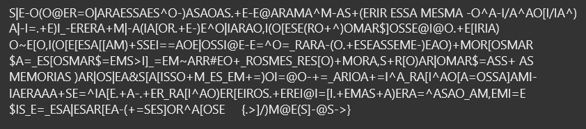
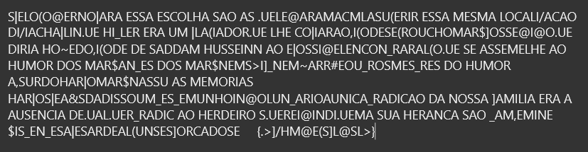
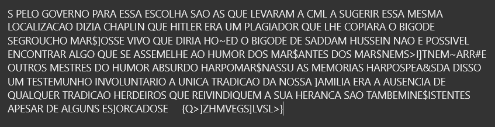

# CTF Semana #10 (Classical Encryption)

?|<-:(:@<;=:|*;*<??*<?^:-)*?*:*?.+<-<@*;*!*^!-*?+(<;%;<??*!<?!*-:^*-%/*^*:[%/%*^)*|-%=.+<)%_-<;<;*+!|-*(%*[:;.+<-)<^:|%*;*:,%(:[<?<(;:+^):!*;$]:??<@%@:.+<[%;%*):~<[:,%(:[<[<?*[[*!)+??<%==*:<|:??%@<-<=^:=_;*;*-(:.+<?<*??<!<-)<*:)+!:;[:?!*;$*=_<?[:?!*;$=<!?>%]_=<!~*;;#<:+_;:?!<?_;<?[:)+!:;*,?+;[:)*;|:!*;$=*??+*?!<!:;%*?)*;|:?|<*&?[*[%??:+!_<?_<!+=):%=@:-+=_*;%:*+=%^*_;*[%^*:[*=:??*]*!%-%*<;***+?<=^%*[<.+*-.+<;_;*[%^*:)<;[<%;:?.+<;<%@%=[%.+<!*?+*)<;*=^*?*:_*!,<!%=<$%?_<=_<?*|<?*;[<*-(+=?<?]:;^*[:?<{.>]/)!@<(?]-@?->}

Este é o excerto de comunicação de um jornal português, cifrado com uma cifra clássica que transforma as letras habituais em símbolos misteriosos. No final deste existe uma mensagem secreta no formato de {xxxxxxxxxxxxxxxx} que representa o principal objetivo deste CTF.

Começamos por investigar a frequência de cada símbolo da mensagem e as frequências relativas das letras em português:

| Símbolo | Frequência |        | Letra | Frequência |
| ------- | ---------- | ------ | ----- | ---------- |
|  *      |  70        |        |  a    |  14.63%    |
|  <      |  59        |        |  e    |  12.57%    |
|  ?      |  52        |        |  o    |  10.73%    |
|  :      |  45        |        |  s    |  7.81%     |
|  ;      |  38        |        |  r    |  6.53%     |
|  %      |  32        |        |  i    |  6.18%     |
|  +      |  25        |        |  n    |  5.05%     |
|  !      |  25        |        |  d    |  4.99%     |
|  [      |  23        |        |  m    |  4.74%     |
|  =      |  21        |        |  u    |  4.63%     |
|  -      |  19        |        |  t    |  4.34%     |
|  )      |  16        |        |  c    |  3.88%     |
|  ^      |  14        |        |  l    |  2.78%     |
|  _      |  14        |        |  p    |  2.52%     |
|  \|     |  10        |        |  v    |  1.67%     |
|  .      |  10        |        |  g    |  1.30%     |
|  (      |  9         |        |  h    |  1.28%     |
|  @      |  9         |        |  q    |  1.20%     |
|  ]      |  6         |        |  b    |  1.04%     |
|  $      |  5         |        |  f    |  1.02%     |
|  ,      |  4         |        |  z    |  0.47%     |
|  /      |  3         |        |  j    |  0.40%     |
|  >      |  3         |        |  x    |  0.21%     |
|  ~      |  2         |        |  k    |  0.02%     |
|  #      |  1         |        |  w    |  0.01%     |
|  &      |  1         |        |  y    |  0.01%     |

Estamos assim prontos para começar a experimentar fazer substituições.
1. Começamos por trocar **\*** por **A** pois ambos se destacam em termos de frequências.
2. Depois experimentamos substituir **<** por **E** por serem também respetivamente os segundos símbolo e letra mais frequentes.
3. Em seguida, continuamos para o **?** e **O** mas observando a mensagem percebemos que provavelmente não estariamos no caminho certo pois encontramos várias sequências de dois **O**s seguidos. Existem contudo duas letras na língua portuguesa que aparecem várias vezes repetidas, o S e o R. Como o **S** é a quarta letra mais frenquente, este substituiu **?**.
4. Decidimos trocar então o símbolo seguinte, **:**, pelo **O** que continuavamos a ter por atribuir.
5. Continuamos com a análise das frequências e substituímos assim **;** por **R** e **%** por **I**.
6. A partir deste momento a utilização das frequências começou a não ser tão linear pois existiam letras e símbolos com valores de frequências muito parecidos, então começamos a fazer experiências. O + e o ! apareciam o mesmo número de vezes, por isso fomos experimentando em simultâneo. Nem o D nem o N pareciam fazer muito sentido em nenhum nos símbolos. Seguimos por isso para o **M**, substituindo o **!** e de repente começamos a encontrar vários indícios do que pareciam ser já palavras completas, como *memorias* e *mesma*.

    
***Nota:*** Para conseguirmos destacar melhor palavras que julgamos ter decifrado por completo separamo-las com espaços do resto do texto.

7. Experimentamos trocar [ e = por N e D e vice-versa. Reparamos que ao trocar **[** por **D** e **=** por **N** era a forma que fazia mais sentido pois conseguimos destacar expressões como: *da nossa*, *diria*, etc.
8. O **+** continuava sem ter uma letra atribuída e por isso experimentamos trocar por **U** pois era a letra mais frequente das que ainda sobravavam e apesar de não nos dar nenhuma palavra nova completa, pareceu-nos que a troca estava correta uma vez que conseguimos começar a ver palavras mesmo ainda contendo algum símbolo.
9. Observando o excerto como um todo sltou-nos à vista alguns conjuntos de letras como: *...DESADDAM)USSEINNAOE...*, *...UESEASSEME-)EAO)UMORDOSMAR...*, *...AO)ERDEIROS...*. Decidimos com base nisto trocar **)** por **H** pois passariamos a poder destacar *...DE SADDAM HUSSEIN NAO...*, *...UE SE ASSEME-HE AO HUMOR DOS MAR...*.
10. No seguimento desta troca, decidimos experimentar substituir **-** por **L** para formarmos a palavra *ASSEMELHE*.
11. Encontramos após isto a palavra *ES^OLHA*, e decidimos tentar trocar **^** por **C** para obter *ESCOLHA*.

12. Neste momento surgiu-nos um dilema, pois até aqui as trocas pareciam estar a fazer sentido mas não conseguiamos perceber qual seria a primeira palavra pois *S|ELO...* não parecia ser nenhuma palavra. Contudo depois de percebermos que o excerto não começava necessariamente por uma palavra, ou seja que poderia começar pelas últimas letras de uma outra palavra, experimentamos isolar o S inicial e trocar o **|** por **P**.
13. Reparamos depois disto que várias vezes o . se seguia de *UE* e deduzindo que seriam então a palavra *QUE* substituimos **.** por **Q**.
14. Vendo as palavras *LOCALI/ACAO* e  *DI/IA*, experimentamos trocar **/** por **Z** para obter as palavras *LOCALIZAÇÃO* e *DIZIA*.
15. A expressão *DIZIA CHAPLIN QUE HI_LER ERA UM PLA(IADOR QUE LHE COPIARA...* levou-nos a assumir que **_** seria um **T** e **(** um **G**.
16. Já a expressão *PELO GO@ERNO PARA ESSA ESCOLHA SAO AS QUE LE@ARAM A CML A SUGERIR ESSA MESMA LOCALIZACAO...* levou-nos a substituir **@** por **V**.
17. Ao voltarmos à expressão do ponto 15, esta continua com *...COPIARA O,IGODE...*. Sendo Charlin Chaplin e Hitler ambos bastante conhecidos pelos seus bigodes, faz todo o sentido trocar **,** por **B**.

18. Estamos muito perto mas ainda faltam alguns símbolos por descodificar! Reparamos que aparece mais que uma vez o conjunto *MAR\$*. O nosso primeiro pensamento era que se trataria do nome *MARX* e substituimos **$** por **X**, mas havia algumas palavras que não nos pareciam fazer muito sentido perto deste. Contudo, fazendo uma rápida pesquisa na internet descobrimos que Groucho Marx e Harpo Marx foram dois comediantes famosos. Conseguimos assim, com mais certeza separar algumas palavras e ter uma visualização mais clara do texto.
19. Com a expressão *SE GROUCHO MARX ]OSSE VIVO* decidimos trocar **]** por **F** para obtermos a palavra *FOSSE*.
20. A expressão anterior continua com *QUE DIRIA HO~ED O BIGODE DE SADDAM...*. Assumindo que a separação das palavras não foi completamente correta trocamos **~** por **J** e a expressão passou a ser *QUE DIRIA HOJE DO BIGODE DE SADDAM...*.
21. Sobra-nos ainda o conjunto de letras *...ANTES DOS MARX NEM S>IFTNEMJARR#E OUTROS MESTRES DO HUMOR...*. Apesar de não identificarmos logo à primeira vista de que palavras se tratariam, fomos ver que letras ainda não tinham sido atribuídas e concluímos que > e # teriam de se tratar de duas das letras W, Y ou K. O que nos pareceu fazer mais sentido foi transformar a expressão em *...ANTES DOS MARX NEM SWIFT NEM JARRY E OUTROS MESTRES DO HUMOR...*, trocando **>** por **W** e **#** por **Y**, e fazendo uma breve pesquisa descobrimos que Jonathan Swift e Alfred Jarry são dois autores presentes por exemplo no livro *Antologia de Humor Negro*.
22. Falta-os apenas descodificar o símbolo **&** que por exclusão corresponde a **K**, o que pesquisando nos confirmou que de facto tinhamos conseguido descodificar todo o excerto com sucesso uma vez em *...HARPO MARX NAS SUAS MEMORIAS HARPO SPEA&SDA DISSO UM TESTEMUNHO...* confirmamos que Harpo Marx escreveu um livro de memórias chamado *Harpo Spreaks!*.

---
S PELO GOVERNO PARA ESSA ESCOLHA SAO AS QUE LEVARAM A CML A SUGERIR ESSA MESMA LOCALIZACAO DIZIA CHAPLIN QUE HITLER ERA UM PLAGIADOR QUE LHE COPIARA O BIGODE SE GROUCHO MARX FOSSE VIVO QUE DIRIA HOJE DO BIGODE DE SADDAM HUSSEIN NAO E POSSIVEL ENCONTRAR ALGO QUE SE ASSEMELHE AO HUMOR DOS MARX ANTES DOS MARX NEM SWIFT NEM JARRY E OUTROS MESTRES DO HUMOR ABSURDO HARPO MARX NAS SUAS MEMORIAS HARPO SPEAKS DA DISSO UM TESTEMUNHO INVOLUNTARIO A UNICA TRADICAO DA NOSSA FAMILIA ERA A AUSENCIA DE QUALQUER TRADICAO HERDEIROS QUE REIVINDIQUEM A SUA HERANCA SAO TAMBEM INEXISTENTES APESAR DE ALGUNS ESFORCADOS E     {QWFZHMVEGSFLVSLW}
---

Conseguimos descodificar! A nossa flag é assim **flag{qwfzhmvegsflvslw}**.