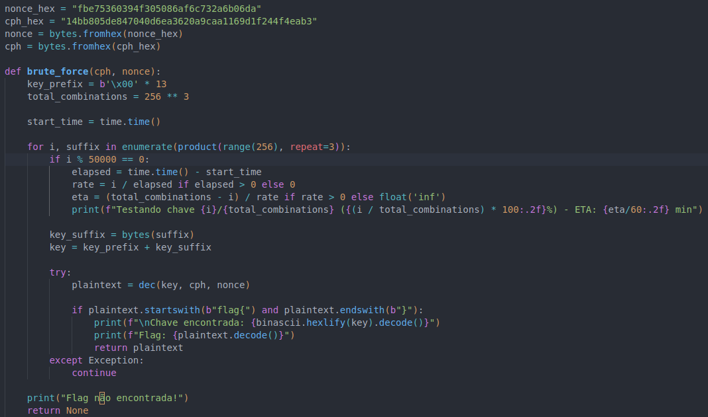
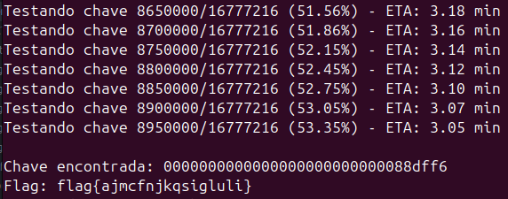

CTF11

Tarefa 1:

    Apenas os últimos offset bytes da chave são gerados aleatoriamente, enquanto que os primeiros 16 - offset bytes estão fixos a zero. Com offset = 3, o espaço de chaves possíveis é reduzido para 2^(8*3) = 2^24 = 16.777.216 chaves possíveis, algo atingível com força bruta

    Como consigo usar esta ciphersuite para cifrar e decifrar dados?
    
        A ciphersuite funciona com as funções enc() e dec() para cifrar e decifrar, respetivamente. Primeiro, gera-se uma chave com a função gen(), que cria uma chave de 16 bytes, sendo os primeiros 13 fixos como 0x00 e os últimos 3 aleatórios. Para cifrar, chama-se enc(k, m, nonce), onde k é a chave gerada, m é a mensagem convertida em bytes (m.encode()), e nonce é um valor único em bytes. Isso gera o criptograma correspondente. Para decifrar, usa-se dec(k, c, nonce), fornecendo novamente a chave, o criptograma em bytes, e o mesmo nonce usado na cifração.

    Como consigo fazer uso da vulnerabilidade que observei para quebrar o código?
    
        A vulnerabilidade está na forma como a chave é gerada. Com apenas 3 bytes aleatórios, o espaço de chaves é reduzido para 2^24, o que é pequeno o suficiente para ataques de força bruta. Para explorar essa falha, gera-se todas as combinações possíveis para os últimos 3 bytes da chave (de 0x000000 a 0xFFFFFF) e concatena-se com os primeiros 13 bytes fixos (0x00000000000000000000000000). Para cada chave gerada, basta tentar decifrar o criptograma com a função dec() e verificar se a saída segue o formato esperado (flag{...}), indicando que a chave correta foi encontrada.
        
        
	Como consigo automatizar este processo, para que o meu ataque saiba que encontrou a flag?

		A automação pode ser feita escrevendo um script que percorra todas as combinações de 3 bytes para os últimos bits da chave, testando cada chave gerada na função dec(). Após cada tentativa, verifica-se se o texto decifrado começa com "flag{", o que confirma que a chave correta foi encontrada. Isso pode ser implementado com bibliotecas como itertools.product para gerar combinações de bytes e um loop que aplica a função de decifração em cada tentativa, interrompendo quando o padrão esperado é identificado.

Tarefa 2
		
		O script estimou que seria necessário 6,13 minutos para testar 2^24 chaves, ou seja, o tempo médio por chave é:
			(6,13 * 60)/(2^24) = 0.022ms por chave

		Com base nesse tempo, podemos calcular quantas chaves podem ser testadas em 10 anos:

			1 ano tem 31.536.00031.536.000 segundos.
			10 anos equivalem a 10×31.536.000 = 315.360.000 segundos
			Total de chaves testáveis em 10 anos:
			chaves testáveis= 315.360.000/(0.022 * 10^(-3)) = 1,43 x 10^13 chaves

		Para tornar a força bruta inviável, o espaço de chaves deve exceder esse valor. logaritmo base 2:
	
			x > log⁡2(1,43×10^13) ≈ 43,8

	Isso significa que a chave deve ter pelo menos 44 bits aleatórios para que a força bruta leve mais de 10 anos.
	
Tarefa 3
	
		Usar um nonce de 1 byte e não transmiti-lo é ineficaz porque apenas adiciona 2^8 combinações por chave, o que é irrelevante frente ao espaço de chaves pequeno (2^24). Além disso, nonces tão curtos aumentam o risco de colisões e não resolvem a baixa entropia na geração de chaves, deixando o esquema vulnerável a ataques de força bruta e outras falhas criptográficas.
