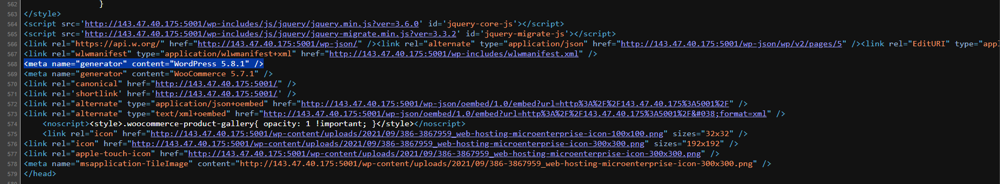
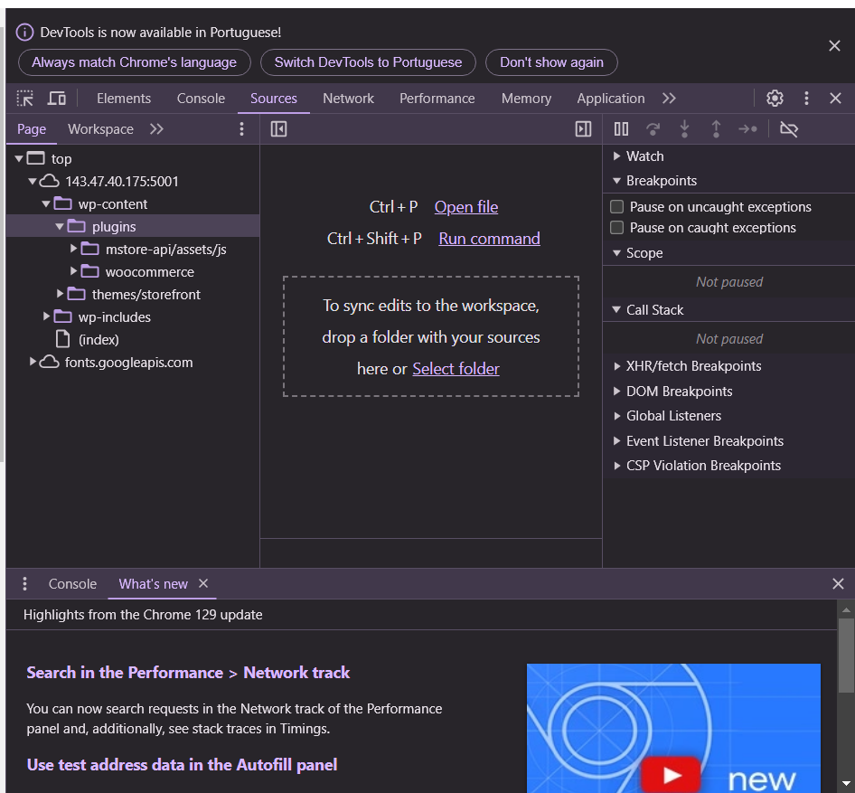
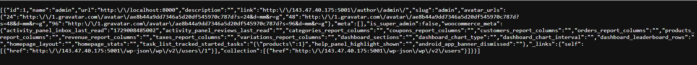
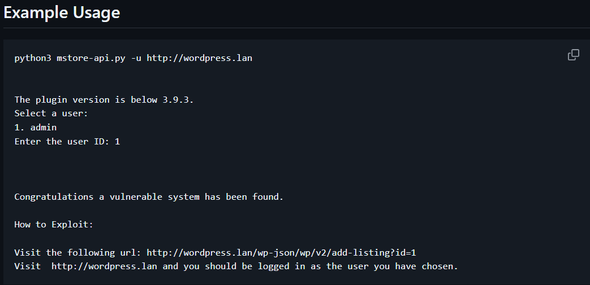
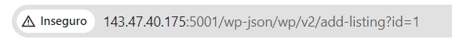
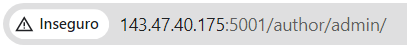
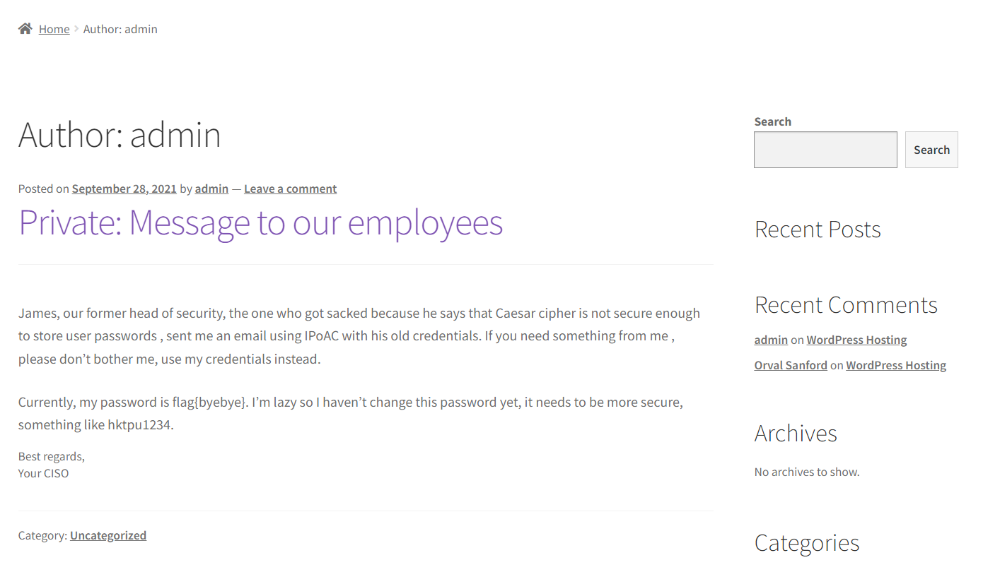

# CTF 3 - SEMANA 3

## Wordpress CVE

### 1. Reconhecimento
Após ver o código fonte da página do site encontramos a versão do wordpress e do woocommerce:
- Versão do wordpress: 5.8.1  
- Versão plugin woocommerce: 5.7.1

Inspecionando a página encontramos também uma pasta pública com os plugins instalados

Com recurso a uma API encontramos um possível utilizador e o seu nome, que no caso será o administrador do site

### 2. Pesquisa por vulnerabilidades
Ao fazer uma busca por vulnerabilidades baseadas na informação recolhida e nas versões que identificamos encontramos vários CVEs como por exemplo: 
- CVE-2022-3590
- CVE-2022-21663
- CVE-2023-2745
- CVE-2023-2732
- CVE-2023-5561
- CVE-2023-39999
- ...

### 3. Escolha da vulnerabilidade
Como o nosso objetivo é identificar uma CVE que permita fazer login como outro utilizador, decidimos experimentar o CVE-2023-2732, em que o plugin MStore API para a WordPress se mostra vulnerável ao desvio de autenticação em versões até à 3.9.2 inclsive. Isto deve-se à verificação insuficiente do utilizador fornecido durante a solicitação da API REST de adição de listagem pelo plugin, possiblitando assim que atacantes não autenticados façam login como qualquer utilizador existente no site, como um administrador, se tiverem acesso ao ID do utilizador, que é o nosso caso.

Encontramos assim a resposta ao primeiro desafio:
> Desafio 1: flag{CVE-2023-2732}

### 4. Encontrar um exploit
Procurando pelo CVE-2023-2732 encontramos um repositório no GitHub que explora o CVE e que nos dá um exploit.

### 5. Explorar a vulnerabilidade
Utilizando e adaptando o que encontramos anteriormente do exploit experimentamos visitar o seguinte url:

Vistando novamente o site, estamos autenticados como administrador:

Encontramos assim a resposta ao segundo desafio:
> desafio 2: flag{byebye}