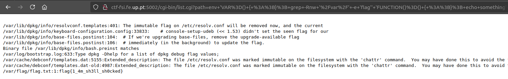

**Reconhecimento:**

Sabendo que o servidor é baseado em Linux, começamos a analisar potenciais pontos de vulnerabilidade comuns a servidores web. Um dos vetores de ataque clássicos em sistemas Linux que envolvem variáveis de ambiente é o Shellshock.
O Shellshock é uma vulnerabilidade conhecida no GNU Bash, que permite que um atacante execute comandos arbitrários em sistemas vulneráveis. Essa vulnerabilidade foi divulgada em 2014 com o identificador CVE-2014-6271.

**Confirmação de vulnerabilidade:**

Para confirmar que o servidor era vulnerável ao Shellshock, enviámos uma requisição HTTP especialmente criada para explorar essa falha. Utilizamos o comando abaixo, que tenta definir uma função de ambiente maliciosa e executar um comando:

env 'VAR=() { :;}; echo Bash is vulnerable!' 'FUNCTION()=() { :;};  '/' -Rnw /home -e "flag"' bash -c "echo Bash Test"

Quando o comando é executado num sistema vulnerável, a saída inclui a string "Bash is vulnerable!", indicando que o Bash está a executar comandos a partir de variáveis de ambiente maliciosas.

**Exploração**

Com a confirmação de que o servidor é vulnerável ao Shellshock, podemos usar essa falha para explorar o sistema de ficheiros e procurar a flag secreta. O comando utilizado foi:

env 'VAR=() { :;}; grep -Rnw '/var/' -e 'flag'' 'FUNCTION()=() { :;}; echo something' bash -c

Este comando tenta procurar recursivamente dentro do diretório /var por qualquer ficheiro que contenha a string "flag", indicando que pode haver uma flag armazenada em algum ficheiro de configuração ou log.

Ao encontrar o ficheiro que contém a flag, lemos o conteúdo e submetemos o valor encontrado na plataforma CTF para completar o desafio.

