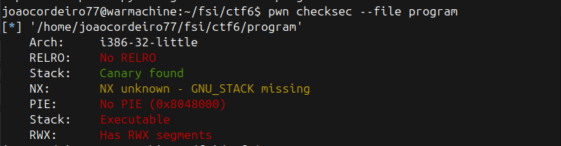
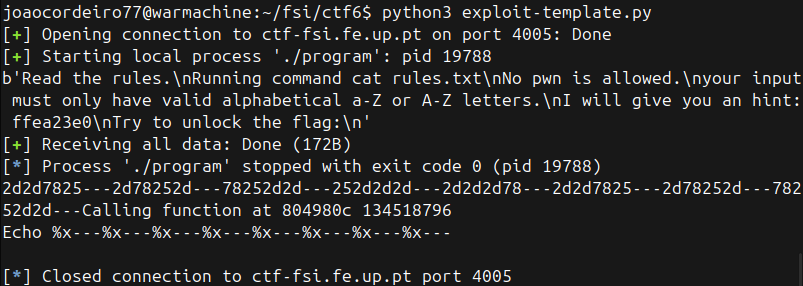
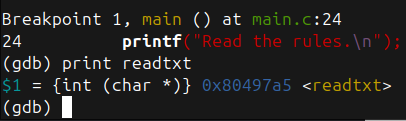
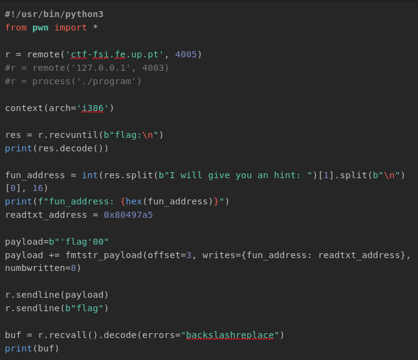
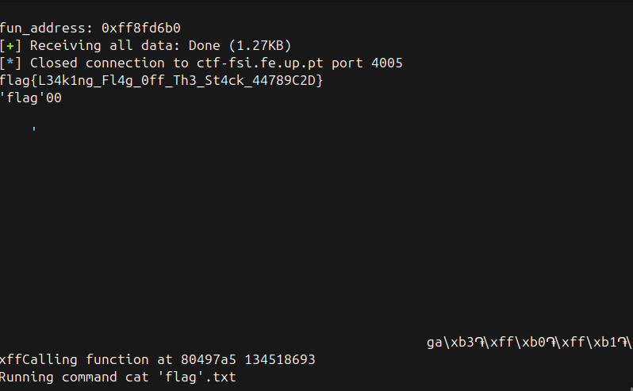

stack canaries FOUND -> harder buffer overflow

NX FOUND -> stack is executable

PIE DISABLED -> fixed memory addresses

RWX segments -> read, write and execute permissions for bynary

QUESTION 1

Yes, the program tries to open and read a file through the readtxt function. By default, it opens rules.txt.

Question 2

Yes, the fun variable is a function pointer which is vulnerable due to the lack of input validation. This allows us to control this pointer and overwrite the echo function to redirect to the readtxt function and pass the "flag" argument.

Question 3

Yes, "printf(buffer);" no format string specifiers are present which allows us to read/write memory by manipulating the input string.

calculating the offset using the echo function

obtaining the readtxt address

fun address was changing so we implemented a dynamic read for its address, input padding and offset alignment sending 'flag' as the new argument to readtxt function

magic!!