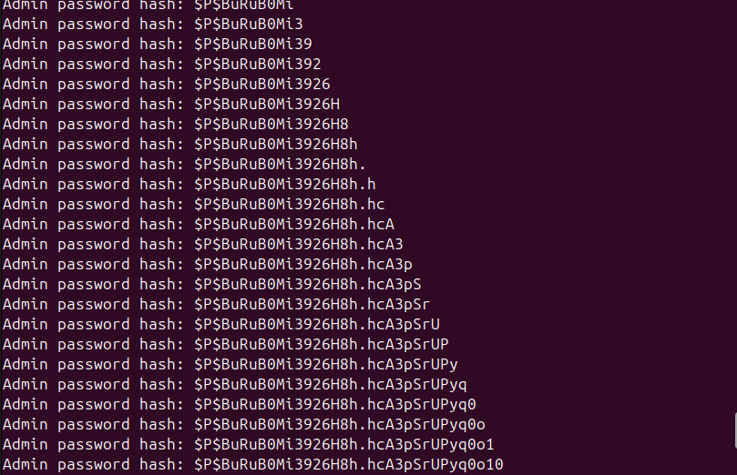
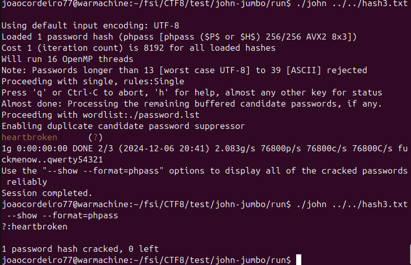

CTF8

- **Recolha de informação**

Começámos por identificar as versões do software e plugins instalados no site WordPress.

    Versão do WordPress: 6.7.1.
    Plugin vulnerável: NotificationX <= 2.8.2.
        Este plugin contém uma API vulnerável em /wp-json/notificationx/v1/analytics.
        A vulnerabilidade permite SQL Injection não-sanitizada.
    Ferramentas utilizadas:
        wpscan: Identificou a versão do WordPress e os plugins instalados.
        Manualmente verificamos os endpoints da API em http://44.242.216.18:5008/wp-json.

* **Vulnerabilidades de SQL**

Bases de dados publicas de Vulnerabilidades:
-   NVD;
-   Exploit-DB;
-   CVE Details;
-   WPScan Vulnerability Database;

Ferramentas automáticas (ex: **sqlmap**)

- **Descoberta e exploração**

Com base na vulnerabilidade reportada (CVE-2024-1698), usamos um exploit para explorar um Time-Based Blind SQL Injection no endpoint vulnerável:

POST http://44.242.216.18:5008/wp-json/notificationx/v1/analytics

Descrição do Ataque

O exploit utiliza a função SLEEP de SQL para medir o tempo de resposta do servidor, permitindo inferir informações sensíveis caracter a caractere.

    Exploração da vulnerabilidade:
        Determinar o comprimento do username e da password hash do administrador.
        Extrair valores caractere a caractere com SUBSTRING e ASCII.

    Ferramentas e técnicas:
        Exploit Python baseado em HTTP POST.
        Injeção de payloads no parâmetro type para manipular queries SQL.

**Endpoint vulnerável:**
http://44.242.216.18:5008/wp-json/notificationx/v1/analytics

Modo de exploração: Time-Based Blind SQL Injection.
Catalogação da vulnerabilidade:

    Tipo: SQL Injection.
    Impacto: Permite acesso a dados sensíveis, incluindo credenciais armazenadas na base de dados.

- **Política de Armazenamento de Senhas**

    O WordPress utiliza o formato de hash phpass:
        Baseado no algoritmo bcrypt.
        Inclui um salt exclusivo para proteger contra ataques de rainbow table.
    Exemplo de hash extraída:

> `$P$BuRuB0Mi3926H8h.hcA3pSrUPyq0o10`

- **Segurança no Armazenamento de Hashes**

Embora o WordPress use bcrypt com salt, existem fatores que podem comprometer a segurança:

    Palavras-passe fracas:
        Senhas curtas ou comuns podem ser quebradas com ataques baseados em dicionários.
    Recuperação de hashes em data leaks:
        Mesmo com salt, ferramentas modernas permitem reverter hashes se a palavra-passe for previsível.

Ferramenta utilizada: John the Ripper

