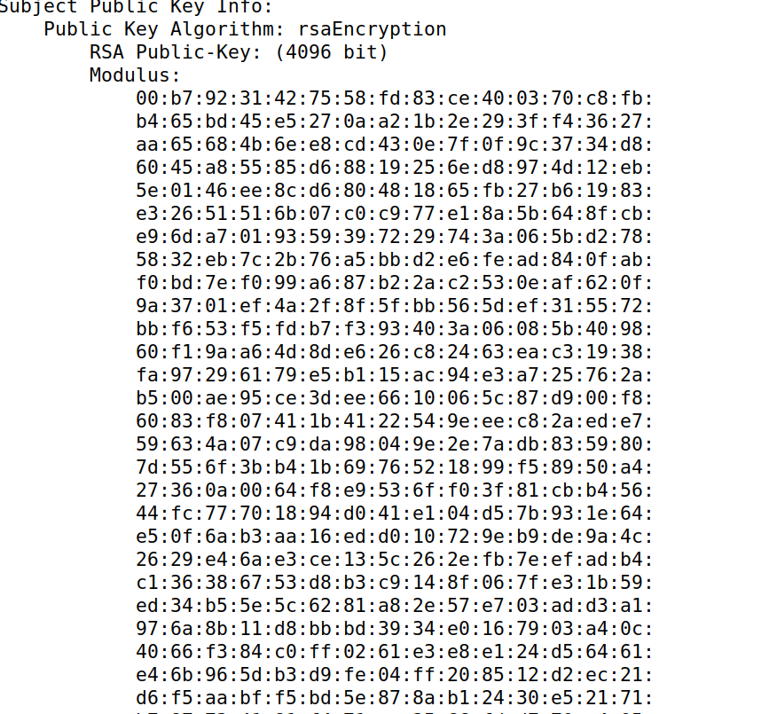
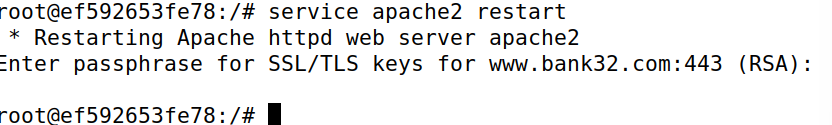

PKI SEEDLABS

labsetup

Task 1: Becoming a Certificate Authority (CA)

 - uncomment “unique_subject” line 
 - created index.txt and serial files
 - issue self-signed certificate

What part of the certificate indicates this is a CA’s certificate?

CA: TRUE

What part of the certificate indicates is a self-signed certificate?
issuer == subject

In the RSA algorithm, we have a public exponent e, a private exponent d, a modulus n, and two secret numbers p and q, such that n = pq. Please identify the values for these elements in your certificate and key files

in ca.crt

Exponent: 65537 (0x10001)

in ca.key

Task 2: Generating a Certificate Request for Your Web Server

our domains
www.l10g0724.com
www.l10g072425.com
www.l10g072024.com

Task 3: Generating a Certificate for your server

we turned csr into a certificate using CA. CA is false unlike self-signed

the Subject Alternative Name field, we can see that the alternative names are included in the certificate

Task 4: Deploying Certificate in an Apache-Based HTTPS Website

our HTTPS website www.l10g07.com
 - created l10g07_apache_ssl.conf in /etc/apache2/sites-available/

 - moved server.crt and server.key to /volumes/
 - ran a2ensite l10g07_apache_ssl
 - start apache server in container

 - after importing the ca certificate we were able to access our domain

Task 5:  Launching a Man-In-The-Middle Attack

