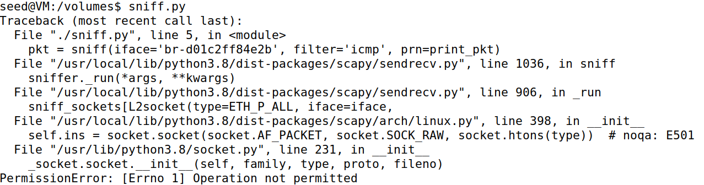
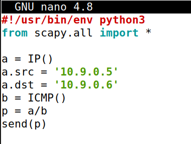
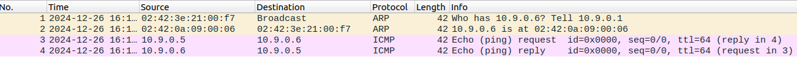
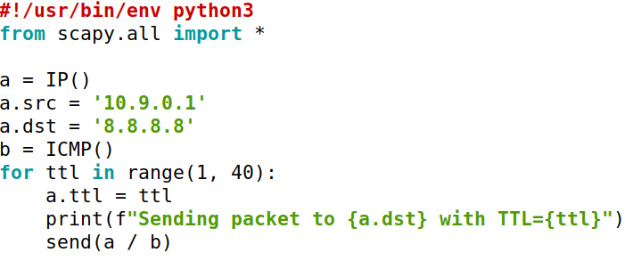
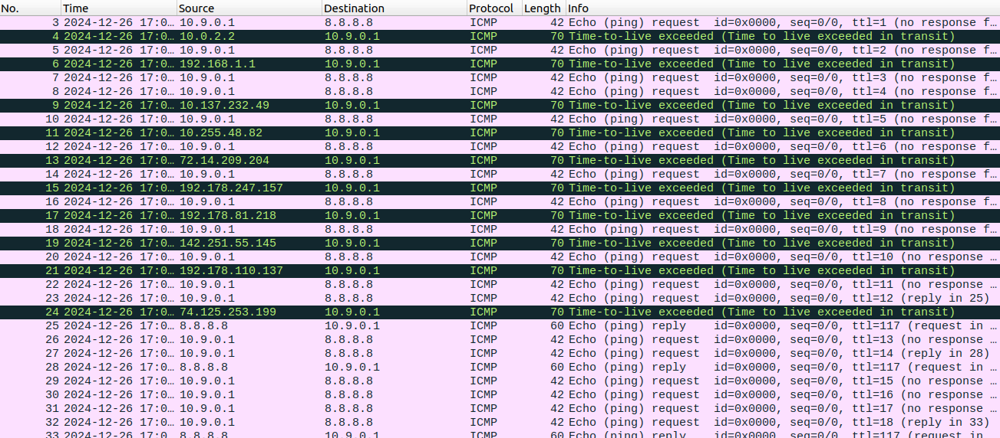
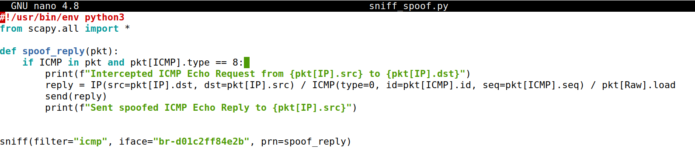
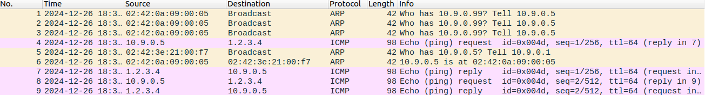
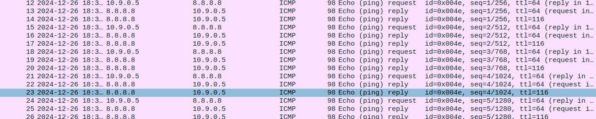
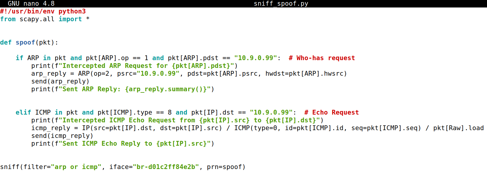
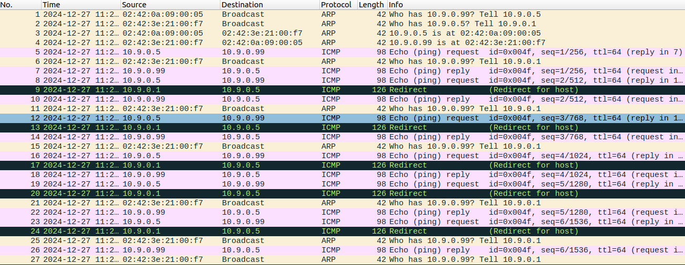

seedlabs \#13 \- sniffing and spoofing

task 1.1A

Tendo os containers iniciados e utilizando o código de sniffing presente no pdf, realizamos um ping a partir do hostA para a interface do attacker (10.9.0.1).

Explicação de camadas de um pacote *sniffed:*

\#\#\#\[ Ethernet \]\#\#\#  
  dst       \= 02:42:3e:21:00:f7  
  src       \= 02:42:0a:09:00:05  
  type      \= IPv4

Link layer \-  responsável por entregar o pacote no mesmo segmento de rede.  
Campos importantes:

* `dst`: Endereço MAC de destino, identificando o dispositivo que deve receber o pacote.  
* `src`: Endereço MAC de origem, indicando o remetente.  
* `type`: Indica que o payload do Ethernet contém um pacote IPv4.

\#\#\#\[ IP \]\#\#\#  
     version   \= 4  
     ihl       \= 5  
     tos       \= 0x0  
     len       \= 84  
     id        \= 3637  
     flags     \= DF  
     frag      \= 0  
     ttl       \= 64  
     proto     \= icmp  
     chksum    \= 0x185d  
     src       \= 10.9.0.5  
     dst       \= 10.9.0.1  
     \\options   \\

Camada de rede \- que guia o pacote entre diferentes redes.  
Campos importantes:

* `ttl`: indica o número de routers pelos quais o pacote ainda pode passar antes de ser descartado.  
* `proto`: especifica o protocolo da próxima camada  
* `src` e `dst`: endereços IP de origem e destino.

\#\#\#\[ ICMP \]\#\#\#  
        type      \= echo-request  
        code      \= 0  
        chksum    \= 0xdb2d  
        id        \= 0x21  
        seq       \= 0x1

Camada de transporte \- para mensagens ICMP, usadas para diagnóstico (como no comando `ping`).

\#\#\#\[ Raw \]\#\#\#  
           load      \= '\\x85\\x88mg\\x00\\x00\\x00\\x00a\\xed\\t\\x00\\x00\\x00\\x00\\x00\\x10\\x11\\x12\\x13\\x14\\x15\\x16\\x17\\x18\\x19\\x1a\\x1b\\x1c\\x1d\\x1e\\x1f \!"\#$%&\\'()\*+,-./01234567'

Payload do pacote, que pode conter informações adicionais ou dados de aplicação.  
No caso de ICMP: aqui estão os dados do `ping`, geralmente preenchidos com valores padrão para teste.

Quando tentámos correr sem ‘root privilege’ obtivemos um ‘PermissionError’ porque o acesso a ‘raw sockets’ é restrito a utilizadores ‘root’.  

task 1.1B

tcp packets para a porta 23 (a partir do hostA):  
echo "netcast attacker from hostA" | nc 10.9.0.1 23

análise de pacote:  
Ethernet \=  
Ip \= (proto \= tcp)  
\#\#\#\[ TCP \]\#\#\#  
        sport     \= 36672  
        dport     \= telnet  
        seq       \= 2976090558  
        ack       \= 0  
        dataofs   \= 10  
        reserved  \= 0  
        flags     \= S  
        window    \= 64240  
        chksum    \= 0x1446  
        urgptr    \= 0  
        options   \= \[('MSS', 1460), ('SAckOK', b''), ('Timestamp', (3950179820,820, 3443681147))\]

Camada TCP, garante a entrega confiável dos dados. Este pacote contém:

* A flag P (Push), indicando que os dados devem ser entregues imediatamente.  
* A flag A (Acknowledgment), reconhecendo que recebeu o último pacote.

\#\#\#\[ Raw \]\#\#\#  
           load      \= 'netcast attacker from hostA\\n'  
Payload da mensagem enviada pelo netcat.

task 1.2

utilizando o script abaixo e correndo no container do atacante,  
  
verificou–se no wireshark verificou-se que o hostB(10.9.0.6) recebeu o pacote ICMP spoofed com o IP de origem falsificado (10.9.0.5).

task 1.3  
desenvolvemos um script que envia pacotes ICMP (Echo Request) com valores de TTL incrementais:  
  
executámos o script e verificamos no wireshark que foram necessários 13 hops para chegar ao ip de destino com sucesso recebendo finalmente um pacote ICMP echo reply do endereço de destino  

task 1.4

começámos por desenvolver o seguinte script que intercepta ICMP requests (pings) e cria uma resposta spoofed para o endereço de origem do pacote;  
  
corremos o script e realizámos os 3 pings a partir do hostA.

primeiro ping (1.2.3.4):  
  
observa-se que o script interceptou o Echo Request e enviou um Echo Reply spoofed.  
Resultado: O hostA recebeu respostas, simulando que o IP `1.2.3.4` estava ativo, embora ele não existisse.

segundo ping (10.9.0.99):

Problema Identificado: O Host A enviou um ARP Request para resolver o endereço MAC de 10.9.0.99, mas o atacante não respondeu.

Resultado: Sem uma resposta ARP, o hostA não enviou o Echo Request, e o spoofing falhou.

Solução: Implementar um script para também spoofar ARP Replies e resolver o problema.

terceiro ping (8.8.8.8):  

observa-se que  script interceptou os Echo Requests e enviou Echo Replies spoofados.

Resultado: Apesar de 8.8.8.8 ser um host real, o hostA recebeu tanto respostas reais quanto spoofadas, mostrando a eficiência do spoofing.

para lidar com a ausência de ARP Replies no caso de hosts inexistentes na LAN, adicionamos a funcionalidade de responder a ARP Requests.  
  
testando novamente o segundo ping (10.9.0.99)  através do hostA:  
com a solução implementada, observa-se que o script passou a enviar ARP Replies spoofed, associando 10.9.0.99 ao MAC do atacante.  
Resultado: O Host A conseguiu enviar o Echo Request e recebeu o Echo Reply spoofado.

