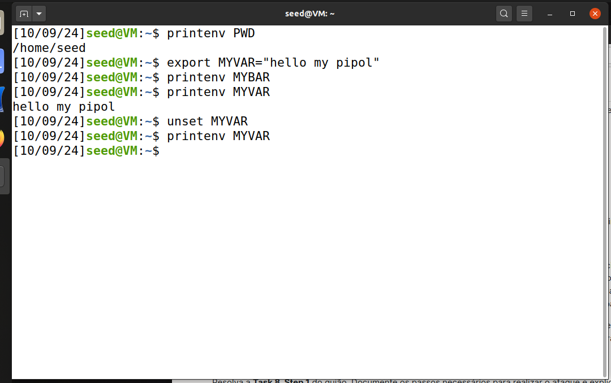
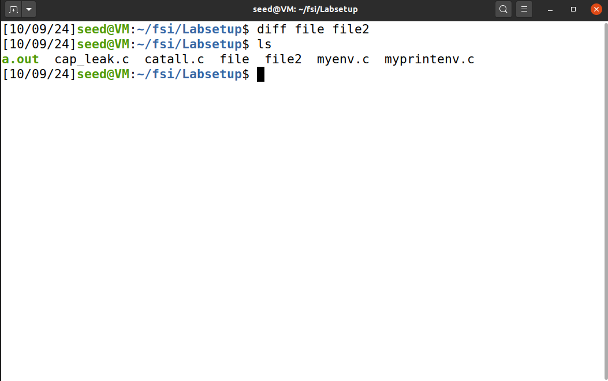
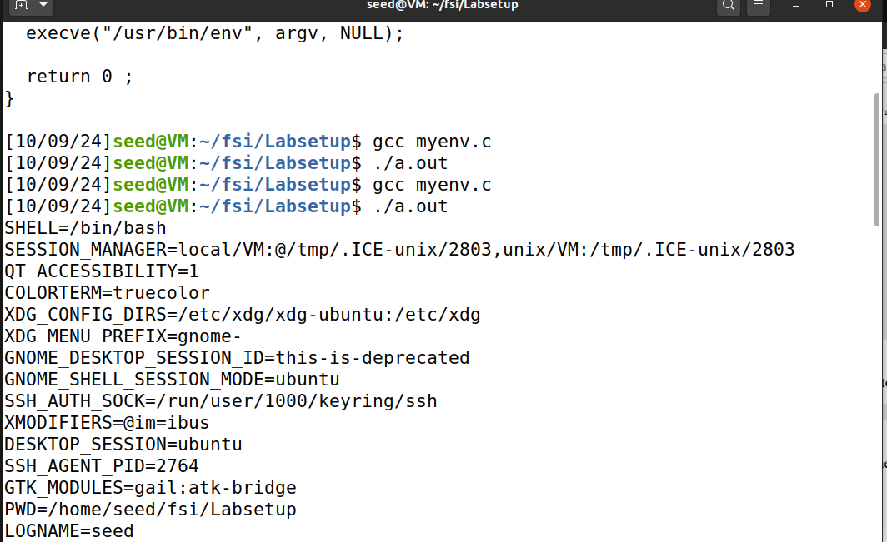
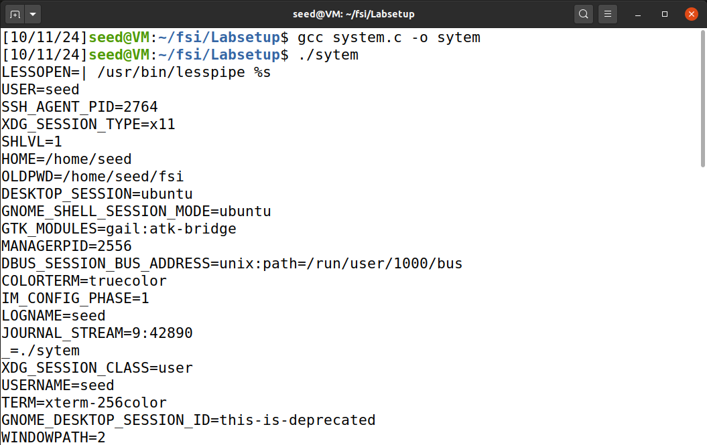
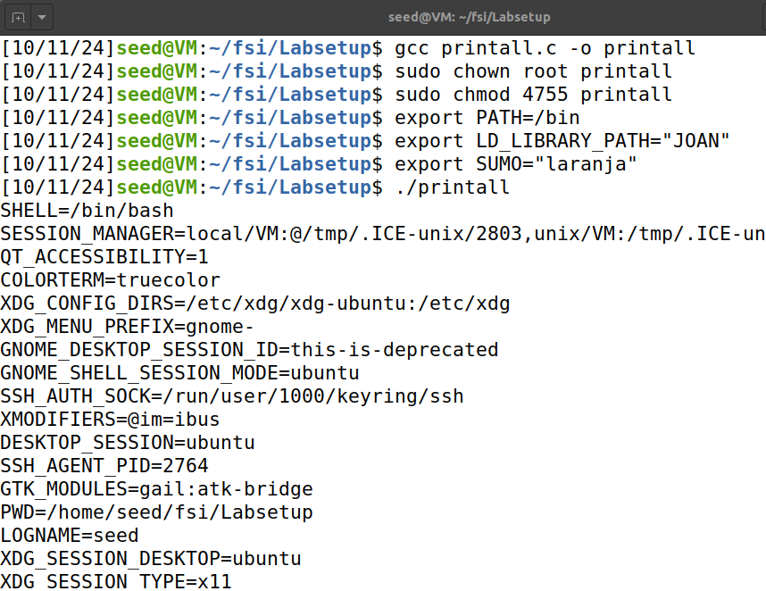
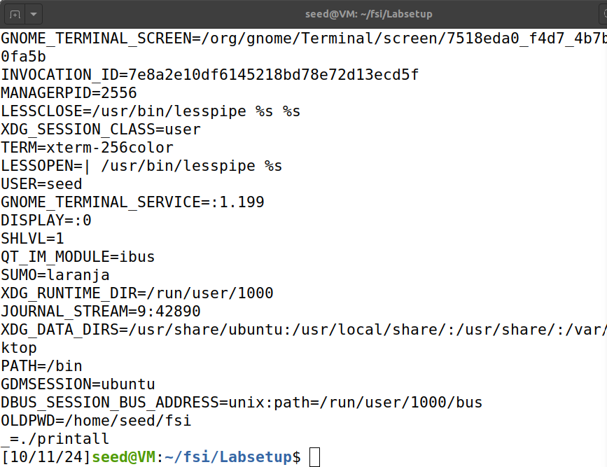
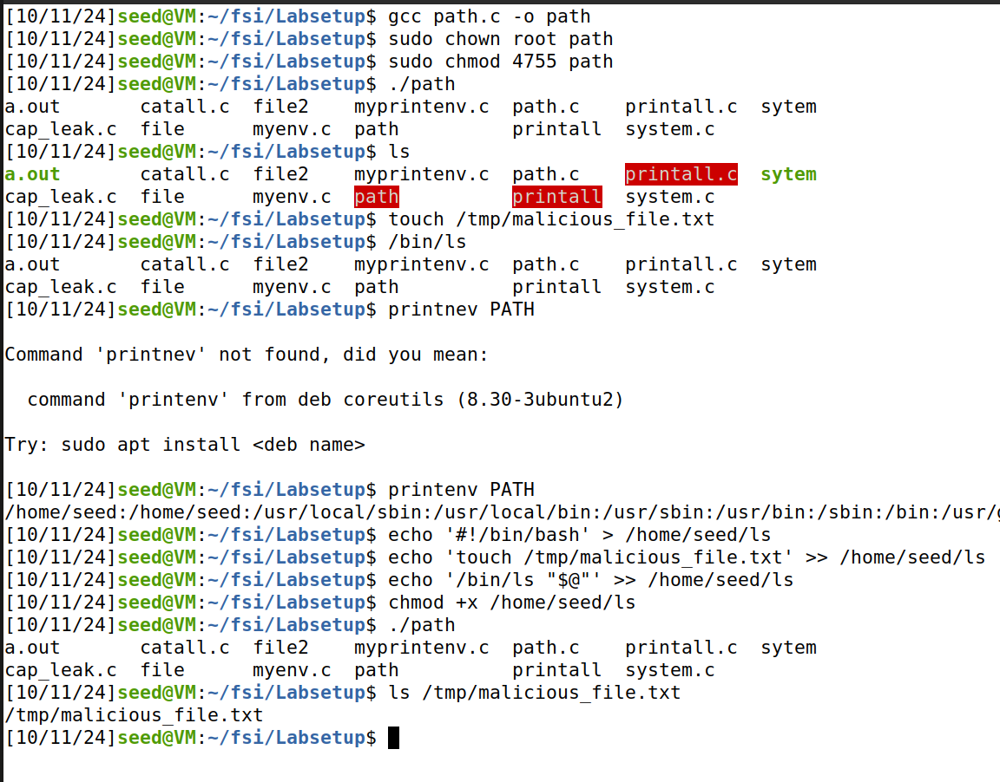
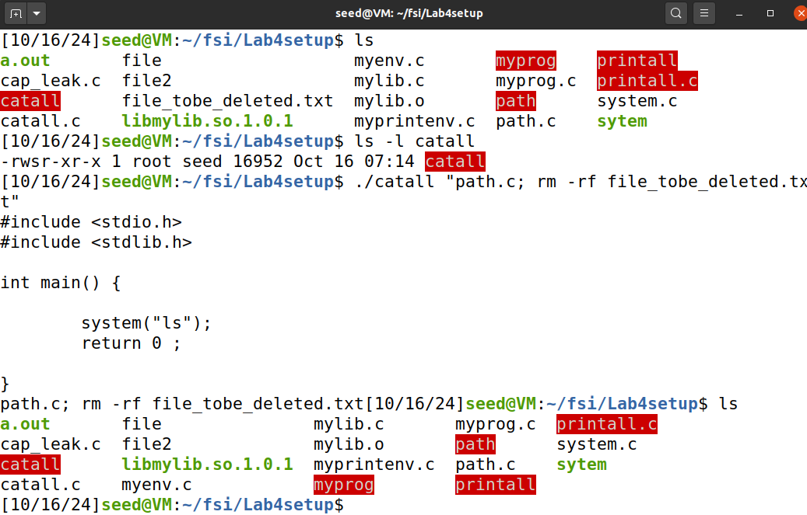

2.1 Done

2.2 After running the program again and saving the output into another file, the parent’s environment variables are being printed and are the same as those printed by the child process. child inherits the parent's environment variables

2.3  Environment variables are only inherited by the new program if they're explicitly passed via the 3rd argument(environ), when NULL the program won't inherit any. execve() needs specification

2.4 The system() function inherits and passes the environment variables of the parent process to the shell (/bin/sh), and from there, to any commands executed.

2.5 unlike custom variables that can be exploited like ´SUMO´, critical variables like LD_LIBRARY_PATH are protected to prevent potential attacks by ensuring that untrusted libraries cannot be loaded. 

2.6 Set-UID programs run with the privileges of the file owner (in this case, root), so when  'path' script is executed, it runs with root privileges.
By changing the PATH environment variable, we're making the Set-UID program run our malicious ls script ('path') instead of the real /bin/ls, allowing us to execute commands with elevated privileges. in this case we created a malicious_file.txt inside the folder /tmp while still printing the files and folders for the current directory. 

2.8
The use of system() in Set-UID programs is dangerous because it invokes the shell and processes the input as a command. In this case, command injection allowed us to execute arbitrary commands with elevated privileges. This highlights the risk of using system() in privileged programs.

