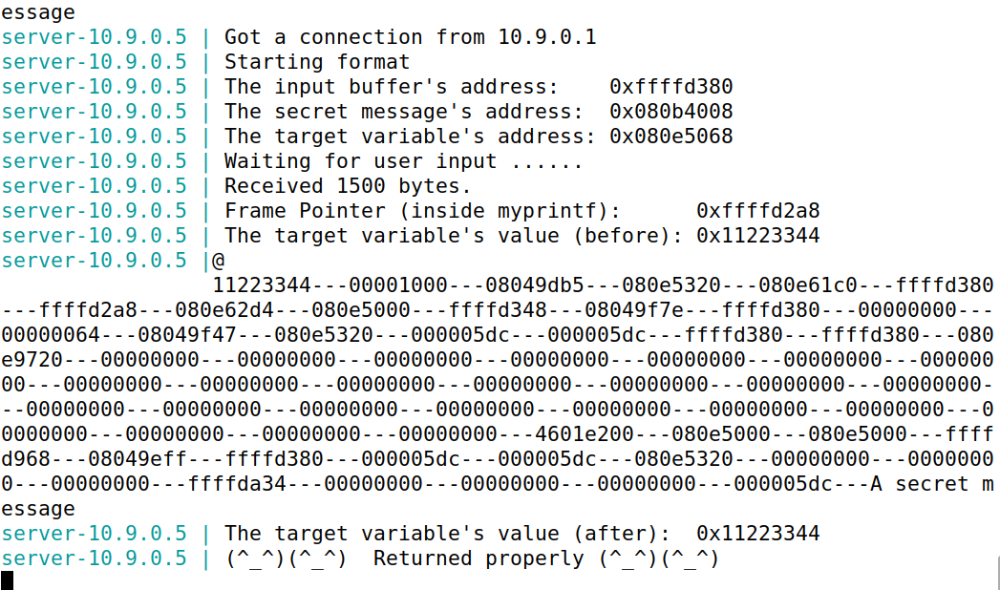

logbook 6 - format string

task 1

começámos por enviar uma mensagem benigna para o servidor, o qual retornou normalmente;

enviámos uma entrada maliciosa com %n várias vezes para o servidor;

"echo "AAAA%n%n%n%n" | nc 10.9.0.5 9090"

observamos que o programa não exibia "Returned properly", ou seja crashou.
O uso de %n causou a escrita num local de memória inesperad o que provocou que o programa chashasse.

task 2

A
criámos uma entrada maliciosa contendo identificadores únicos:

"echo -e "%08x1 %08x2 %08x3 %08x4" | nc 10.9.0.5 9090"

verifica-se que a saída contem os valores na stack, incluindo o identificador "1234", permitindo mapear a posição exata dos dados que queremos acessar.

B
o exploit para construir o payload foi o seguinte:

adicionamos o endereço da mensagem secreta (0x080b4008) no início do buffer;
construímos uma format string para explorar a stack e acessar ao conteúdo do endereço:

o *63 é o número de passos necessários para alinhar o ponteiro de leitura com a posição correta na pilha.

enviando o payload para o servidor, é possível ver a mensagem secreta armazenada no endereço 0x080b4008

task 3

A
colocámos o endereço da variavel target no inicio do buffer:

e verificou-se que a variavel target foi alterada
a variável target é alterada porque imprimimos vários caracteres antes do %n. O número total de caracteres impressos até o ponto %n é usado como novo valor da variável.

B

"%325x" * 63 no exploit serve para imprimir caracteres suficientes antes do %n, sendo o número exato de repetições e preenchimentos ajustado para somar 0x5000

verificou-se a mudança do valor da variável target para 0x5000 como esperado

questão 2:
não. A vulnerabilidade ocorre pela utilização insegura do printf() (ou similar), e não depende de onde a format string está alocada (stack ou heap). As tasks 3A e 3B poderiam falhar, porque alterar valores como por exemplo a variável target depende de controlar endereços e alinhamento na pilha, o que é mais difícil se a string estiver na heap.